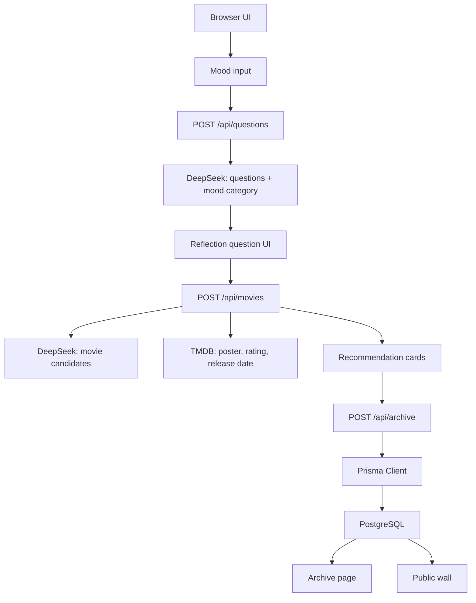

# Architecture

VibeMovie is organized around a simple emotional recommendation pipeline.

## Main Responsibilities

| Layer | Responsibility |
| --- | --- |
| `src/app/page.tsx` | Main emotional recommendation experience |
| `src/app/api/questions` | Turns a mood input into AI-generated questions |
| `src/app/api/movies` | Generates movie candidates and enriches them with TMDB metadata |
| `src/app/api/archive` | Creates and updates emotional movie records |
| `src/app/api/wall` | Reads public emotional records |
| `src/lib/prisma.ts` | Provides the Prisma database client |
| `prisma/schema.prisma` | Defines the persisted emotional record model |

## External Services

- DeepSeek API: generates reflection questions, healing messages, and movie recommendations.
- TMDB API: provides movie posters, ratings, and release metadata.
- PostgreSQL: stores emotional movie records.
