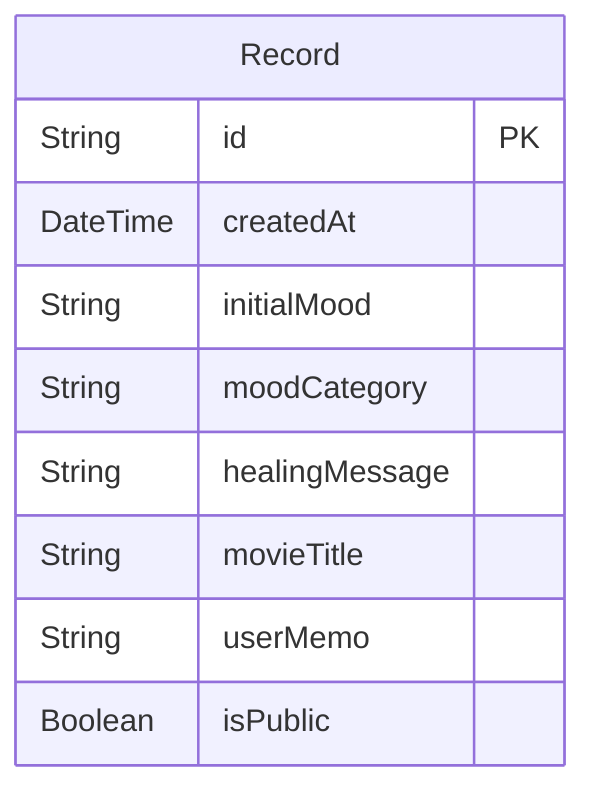

# Database Schema

VibeMovie currently stores one core model: `Record`.

## Record Fields

| Field | Type | Purpose |
| --- | --- | --- |
| `id` | `String` | Unique record ID |
| `createdAt` | `DateTime` | Time when the mood/movie record was created |
| `initialMood` | `String` | User's original mood input |
| `moodCategory` | `String` | AI-selected visual/emotional category |
| `healingMessage` | `String` | Short emotional message generated by AI |
| `movieTitle` | `String` | Selected movie title |
| `userMemo` | `String?` | Optional user note |
| `isPublic` | `Boolean` | Whether the record can appear on the public wall |
