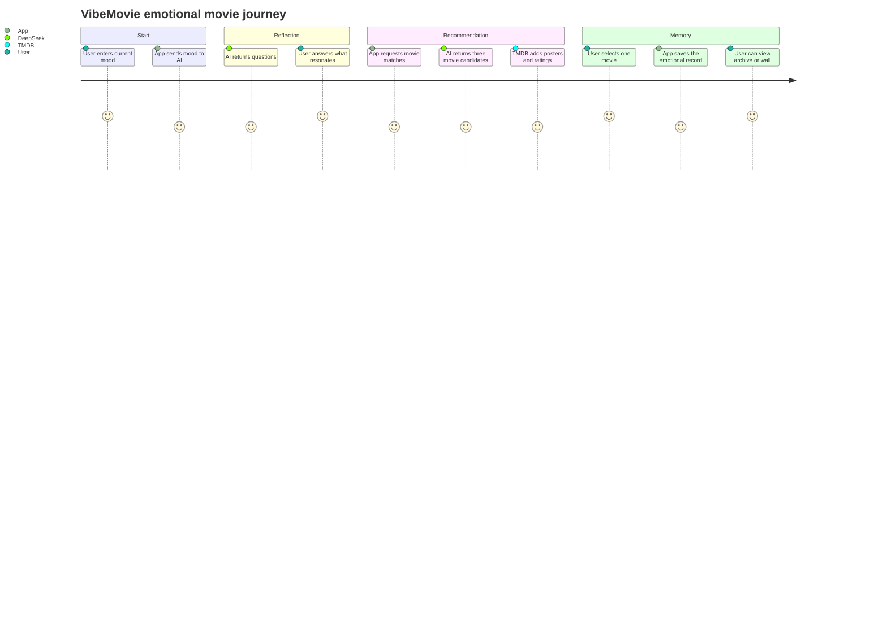

# User Flow

## Flow Summary

1. Mood input: The user describes their current feeling in natural language.
2. Resonance questions: The app asks AI-generated follow-up questions to clarify the emotional context.
3. Movie selection: The app recommends three movies matched to the user's mood and answers.
4. Poster view: The user can create a cinematic shareable poster.
5. Archive: The recommendation is saved as an emotional record.
6. Wall: Public records can be displayed as shared emotional traces.
